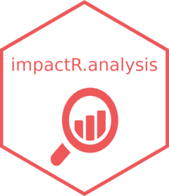

<!-- README.md is generated from README.Rmd. Please edit that file -->

```{r, include = FALSE}
knitr::opts_chunk$set(
  collapse = TRUE,
  comment = "#>",
  fig.path = "man/figures/README-",
  out.width = "100%"
)
```

# impactR.analysis

<!-- badges: start -->
<!-- badges: end -->
<a href="https://gnoblet.github.io/impactR.analysis/"></a>
 
Faster and simpler survey analysis.

## Installation

You can install the development version of impactR.analysis from [GitHub](https://github.com/) with:

``` r
# install.packages("devtools")
devtools::install_github("impact-initiatives-hppu/impactR.analysis")
```

## The `svy_*()` family, wrappers around `srvyr` functions.

`impactR.analysis` contains prepared objects: the survey (`survey`) and choices (`choices`) sheets from Kobo, and a srvyr design object (`design`).

Let's start with examples from the `svy_*()` family which are wrappers arounds some of the `srvyr` package with some standardized outputs.

```{r svy-family, eval = FALSE}
library(impactR.analysis)

# Get proportion for a variable (not kobo related)
# check the help
?svy_prop()
svy_prop(design, vars = "h_2_type_latrine")

# Get proportion with a grouping column and for two vars
# This grouping parameter exists for all svy family function
# It can be a vector of grouping columns
svy_prop(design, vars = c("h_2_type_latrine", "admin1"), group = "milieu")

# Same thing with mean or median 
# % of HHs attending public schools with the dummy variable
svy_mean(design, vars = "e_typ_ecole_publique")
# Median of the # of female age 3-17 yo
svy_median(design, vars = "c_total_3_17_femmes")

# Interaction between variables (e.g. for needs profiles)
# Does it mean something here?
svy_interact(design, c("h_2_type_latrine", "e_typ_ecole_publique"))

# there is also svy_quantile() and svy_ratio()
# and two svy_test_*() functions
svy_quantile(design, vars = c("f_5_depenses_ba", "e_typ_ecole_publique"))
svy_ratio(design, nums = c("e_typ_ecole_publique", "e_typ_ecole_publique"), denoms = c("e_typ_ecole_non_publique", "e_typ_ecole_publique"))

```

Around these functions, there are two 'master' functions:
```{r svy-master, eval = FALSE}
# A master analysis function, you can use "analysis" as the type of analysis. See the function's details
svy_analysis(design, 
             analysis = "prop",
             vars = c("h_2_type_latrine", "e_typ_ecole"))

# For ratios, provide a named vector of num = denom variables
svy_analysis(design,
             analysis = "ratio",
             vars = c("e_typ_ecole_publique" = "e_typ_ecole_publique", "e_typ_ecole_non_publique" = "e_typ_ecole_publique"))

# Then there is this dirty automated function
auto_svy_analysis(design)

```
## Analysis based on a Kobo tool

For all analyses based on a Kobo tool, see: vignette [Survey analysis based on a Kobo tool](https://impact-initiatives-hppu.github.io/impactR.analysis/articles/kobo_analysis.html).
